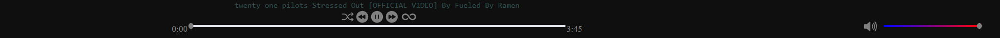

# AudioCity


## Welcome!
Hi!<br>
AudioCity is an **Open-Source** music client, like [**Spotify**](https://open.spotify.com) and [**Pandora.**](https://www.pandora.com/)<br><br>
The difference is that this is **Self-Hosted**, meaning that all songs on this, are **chosen by you, and the site is hosted by you.**<br>
The upside of this, is that when you are hosting it, all songs you have are available when you are offline.

***WARNING:*** Users and playlists not implemented yet. All songs downloaded are available to everyone that connects.

This project is only developed by [Lunadevvv](https://github.com/lunadevvv), so updates might be slow. If you want any updates, feel free to edit the source yourself, and maybe make a pull request!

## How to install
First things first, you need these things installed
* ***Nodejs***
* ***Git*** (Not required)

If you have git or are using git, run

git clone https://github.com/lunadevvv/audiocity.git

If you don't have git, you can also download the latest release as a zip file.

Once you have that folder, and extract it, and open in in your command line.<br>
after that, just run npm install, and it should be ready to go.<br>
To start the server, just run: <br>
npm run test

it should output:
```
@###############################################@
AudioCity is running at http://localhost:5000/
@###############################################@
```

To change the port, add the flag --port PORT-NUMBER

### run with NGROK instructions
The problem with the original hosting, is that its only available on the main system. Ngrok is our bypass.<br>
***First thing that is needed is an ngrok account.***<br>
Sign up at [ngrok.com](https://ngrok.com/)

Once you do that, and copy your auth token. and fill in the respective contents in the  [env file](./.env-example)<br>
You will also need to rename .env-example to .env

Once you are done with that, just run:<br> npm run test-ngrok

It should ouput:
```
@###############################################@
AudioCity is running at http://localhost:5000/
AudioCity NGROK link is https://random-characters.ngrok-free.app
@###############################################@
```

## How to use
Currently there is not much to the website, but here is the gist of whats currently added


Currently there is only downloading from link. To download a song, just type / paste it in this field. Once you click off, or press enter it will automatically download.

Once it downloads, under All Songs a button should appear that looks like this.


To play the song, just click on it. To delete the song, click on the trash icon.



These controls are pretty self explanitory, so I am only going to go over the loop button (the infinity symbol).

**A gray loop button means, once all of the songs are over it wont loop**<br>
**A green loop button means it will loop all songs**
**A red loop button means it will loop one song**

## Development
AudioCity runs on an [Express](https://expressjs.com/) server, with [Node.js](https://nodejs.org), with the communication between server to client is run through an API.

**Here are all of the API enpoints, and what they return**<br>
**All endpoints are GET**<br>

### /deleteSong
**URL Params: **<br>
*author*:  the channel name for the song<br>
*name*:  the name of the song.

***Warning:  This function doesn't check if the file was successfully deleted. The reloading of songs normally does that.***<br>
**Returns**:<br>

* Success:<br>
* * String:  "Deleted!"

* Fail:<br>
* * String:  "Missing fields"

### /downloadSong
**URL Params: **<br>
*Link* : The song link

**Returns**:<br>
* Success:<br>
* * String : "downloaded"<br>
* Fail <br>
* * String : "Missing fields"
* * String : "Not a valid yt link, Or failed to download"


### /getAllSongs
**Returns**
* Success (Always a success)
* * Array&lt;song>

### /getSong
**URL Params: **<br>
*author*:  the channel name for the song<br>
*name*:  the name of the song.

**Returns**:<br>
* Success:<br>
* * File : media/mpeg<br>
* Fail <br>
* * String : "Missing fields"
* * String : "Unable to find song!"

### /getThumbnail
**URL Params: **<br>
*author*:  the channel name for the song<br>
*name*:  the name of the song.

**Returns**<br>
* Success<br>
* * File : png<br>
* Fail<br>
* * String : "Missing fields"
* * String : "Unable to find song!"
